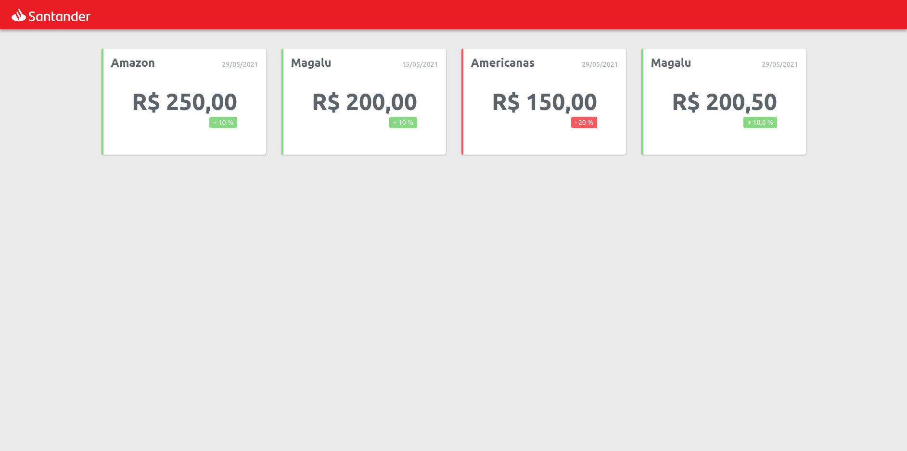

# Santander Dev Week - Frontend

O Santander Dev Week é um evento de tecnologia que tem como objetivo compatilhar conhecimento das tecnologias utilizadas pela empresa nos seus projetos.


## Frontend

O _frontend_ da aplicação foi feito em JavaScript, utilizando o framework Angular. O objetivo dessa parte do projeto foi montar uma página que pudesse consumir a API REST produzida pelo [_backend_](https://github.com/LucasSargeir/Santader-Dev-Week-Backend) e aprender os conceitos do framework.

Esse projeto foi gerado com o [Angular CLI](https://github.com/angular/angular-cli) versão 12.0.2.


## Utilização

Acesse a página clicando [aqui](https://lucassargeir.github.io/Santader-Dev-Week-Frontend/).


### Local

Para rodar o projeto localmente, clone o repositório:

```bash
git clone https://github.com/LucasSargeir/Santader-Dev-Week-Frontend.git
```

Instale as dependências:

```bash
npm install
```

Inicie o servidor local:

```bash
npm run start
```

> Obs.: Se a página não abrir automaticamente acesse a mesma clicando [aqui](http://localhost:4200).


## Visual


